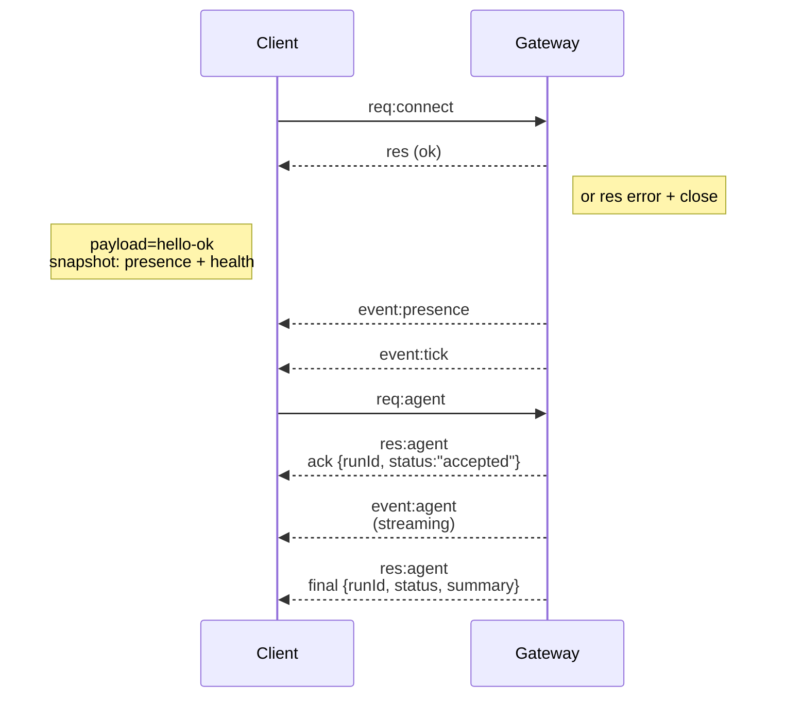

# Kiến trúc Gateway

Cập nhật lần cuối: 2026-01-22

## Tổng quan

- Một **Gateway** duy nhất, tồn tại lâu dài, sở hữu tất cả các bề mặt nhắn tin (WhatsApp qua Baileys, Telegram qua grammY, Slack, Discord, Signal, iMessage, WebChat).
- Các máy khách mặt phẳng điều khiển (ứng dụng macOS, CLI, giao diện web, tự động hóa) kết nối với Gateway qua **WebSocket** trên máy chủ liên kết đã cấu hình (mặc định `127.0.0.1:18789`).
- Các **node** (macOS/iOS/Android/headless) cũng kết nối qua **WebSocket**, nhưng khai báo `role: node` với các giới hạn/lệnh rõ ràng.
- Một Gateway cho mỗi máy chủ; đây là nơi duy nhất mở một phiên WhatsApp.
- **Máy chủ canvas** được phục vụ bởi máy chủ HTTP của Gateway dưới:
  - `/__openclaw__/canvas/` (HTML/CSS/JS có thể chỉnh sửa bởi agent)
  - `/__openclaw__/a2ui/` (máy chủ A2UI)
    Nó sử dụng cùng cổng với Gateway (mặc định `18789`).
## Các thành phần và luồng

### Gateway (daemon)

- Duy trì kết nối nhà cung cấp.
- Cung cấp một WS API có kiểu (yêu cầu, phản hồi, sự kiện đẩy từ máy chủ).
- Xác thực các khung đến dựa trên JSON Schema.
- Phát ra các sự kiện như `agent`, `chat`, `presence`, `health`, `heartbeat`, `cron`.

### Máy khách (ứng dụng macOS / CLI / quản trị web)

- Một kết nối WS cho mỗi máy khách.
- Gửi yêu cầu (`health`, `status`, `send`, `agent`, `system-presence`).
- Đăng ký sự kiện (`tick`, `agent`, `presence`, `shutdown`).

### Các node (macOS / iOS / Android / không giao diện)

- Kết nối đến **cùng một máy chủ WS** với `role: node`.
- Cung cấp một định danh thiết bị trong `connect`; việc ghép nối là **dựa trên thiết bị** (vai trò `node`) và sự chấp thuận nằm trong kho lưu trữ ghép nối thiết bị.
- Cung cấp các lệnh như `canvas.*`, `camera.*`, `screen.record`, `location.get`.

Chi tiết giao thức:

- [Giao thức Gateway](/gateway/protocol)

### WebChat

- Giao diện người dùng tĩnh sử dụng Gateway WS API cho lịch sử trò chuyện và gửi tin nhắn.
- Trong các thiết lập từ xa, kết nối thông qua cùng một đường hầm SSH/Tailscale như các
clients.

## Vòng đời kết nối (một máy khách)



## Giao thức truyền tải (tóm tắt)

- Giao thức truyền tải: WebSocket, khung văn bản với tải trọng JSON.
- Khung đầu tiên **phải** là `connect`.
- Sau khi bắt tay:
  - Yêu cầu: `{type:"req", id, method, params}` → `{type:"res", id, ok, payload|error}`
  - Sự kiện: `{type:"event", event, payload, seq?, stateVersion?}`
- Nếu `OPENCLAW_GATEWAY_TOKEN` (hoặc `--token`) được đặt, `connect.params.auth.token`
  phải khớp hoặc socket sẽ đóng.
- Các khóa Idempotency là bắt buộc đối với các phương thức gây tác dụng phụ (`send`, `agent`) để
  thử lại an toàn; máy chủ giữ một bộ đệm khử trùng tồn tại trong thời gian ngắn.
- Các node phải bao gồm `role: "node"` cộng với caps/commands/permissions trong `connect`.
## Ghép nối + tin cậy cục bộ

- Tất cả các máy khách WS (người vận hành + node) đều bao gồm một **định danh thiết bị** trên `connect`.
- ID thiết bị mới yêu cầu phê duyệt ghép nối; Gateway cấp một **mã thông báo thiết bị** cho các kết nối tiếp theo.
- Các kết nối **cục bộ** (local loopback hoặc địa chỉ tailnet của chính máy chủ gateway) có thể được tự động phê duyệt để giữ cho trải nghiệm người dùng trên cùng một máy chủ được mượt mà.
- Tất cả các kết nối phải ký vào nonce `connect.challenge`.
- Tải trọng chữ ký `v3` cũng liên kết `platform` + `deviceFamily`; gateway ghim siêu dữ liệu đã ghép nối khi kết nối lại và yêu cầu ghép nối lại để thay đổi siêu dữ liệu.
- Các kết nối **không cục bộ** vẫn yêu cầu phê duyệt rõ ràng.
- Xác thực Gateway (`gateway.auth.*`) vẫn áp dụng cho **tất cả** các kết nối, cục bộ hoặc từ xa.

Chi tiết: [Giao thức Gateway](/gateway/protocol), [Ghép nối](/channels/pairing), [Bảo mật](/gateway/security).

## Định kiểu giao thức và tạo mã

- Các schema TypeBox định nghĩa giao thức.
- JSON Schema được tạo ra từ các schema đó.
- Các mô hình Swift được tạo ra từ JSON Schema.

## Truy cập từ xa

- Ưu tiên: Tailscale hoặc VPN.
- Thay thế: Đường hầm SSH

  ```bash
  ssh -N -L 18789:127.0.0.1:18789 user@host
  ```

- Cùng một bắt tay + mã thông báo xác thực được áp dụng qua đường hầm.
- Có thể bật TLS + ghim tùy chọn cho WS trong các thiết lập từ xa.

## Tổng quan hoạt động

- Khởi động: __OC_I19N_0000__ (chạy nền trước, ghi nhật ký ra stdout).
- Tình trạng: __OC_I19N_0001__ qua WS (cũng được bao gồm trong __OC_I19N_0002__).
- Giám sát: launchd/systemd để tự động khởi động lại.

## Các bất biến

- Chỉ một Gateway duy nhất kiểm soát một phiên Baileys trên mỗi máy chủ.
- Việc bắt tay là bắt buộc; bất kỳ khung đầu tiên nào không phải JSON hoặc không phải kết nối sẽ bị đóng cứng.
- Các sự kiện không được phát lại; máy khách phải làm mới khi có khoảng trống.
