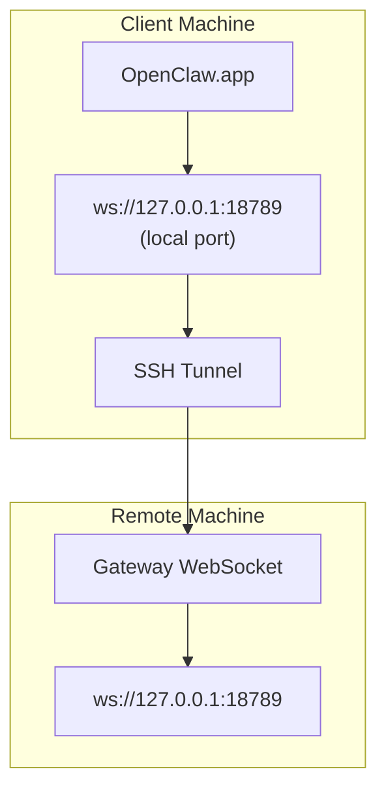

# Chạy OpenClaw.app với một Gateway Từ xa

OpenClaw.app sử dụng SSH tunneling để kết nối với một gateway từ xa. Hướng dẫn này cho bạn biết cách thiết lập nó.
## Tổng quan


## Bắt đầu nhanh

### Bước 1: Thêm Cấu hình SSH

Chỉnh sửa `~/.ssh/config` và thêm:

```ssh
Host remote-gateway
    HostName <REMOTE_IP>          # e.g., 172.27.187.184
    User <REMOTE_USER>            # e.g., jefferson
    LocalForward 18789 127.0.0.1:18789
    IdentityFile ~/.ssh/id_rsa
```

Replace `<REMOTE_IP>` and `<REMOTE_USER>` with your values.

### Step 2: Copy SSH Key

Copy your public key to the remote machine (enter password once):

```bash
ssh-copy-id -i ~/.ssh/id_rsa <REMOTE_USER>@<REMOTE_IP>
```

### Step 3: Set Gateway Token

```bash
launchctl setenv OPENCLAW_GATEWAY_TOKEN "<your-token>"
```

### Step 4: Start SSH Tunnel

```bash
ssh -N remote-gateway &
```

### Step 5: Restart OpenClaw.app

```bash
# Quit OpenClaw.app (⌘Q), then reopen:
open /path/to/OpenClaw.app
```

Ứng dụng sẽ kết nối với Gateway từ xa thông qua đường hầm SSH.

---
## Tự động khởi động Tunnel khi Đăng nhập

Để SSH tunnel khởi động tự động khi bạn đăng nhập, hãy tạo một Launch Agent.

### Tạo tệp PLIST

Lưu cái này dưới dạng `~/Library/LaunchAgents/ai.openclaw.ssh-tunnel.plist`:

```xml
<?xml version="1.0" encoding="UTF-8"?>
<!DOCTYPE plist PUBLIC "-//Apple//DTD PLIST 1.0//EN" "http://www.apple.com/DTDs/PropertyList-1.0.dtd">
<plist version="1.0">
<dict>
    <key>Label</key>
    <string>ai.openclaw.ssh-tunnel</string>
    <key>ProgramArguments</key>
    <array>
        <string>/usr/bin/ssh</string>
        <string>-N</string>
        <string>remote-gateway</string>
    </array>
    <key>KeepAlive</key>
    <true/>
    <key>RunAtLoad</key>
    <true/>
</dict>
</plist>
```

### Load the Launch Agent

```bash
launchctl bootstrap gui/$UID ~/Library/LaunchAgents/ai.openclaw.ssh-tunnel.plist
```

The tunnel will now:

- Start automatically when you log in
- Restart if it crashes
- Keep running in the background

Legacy note: remove any leftover `com.openclaw.ssh-tunnel` LaunchAgent nếu có.

---
## Khắc phục sự cố

**Kiểm tra xem tunnel có đang chạy không:**

```bash
ps aux | grep "ssh -N remote-gateway" | grep -v grep
lsof -i :18789
```

**Restart the tunnel:**

```bash
launchctl kickstart -k gui/$UID/ai.openclaw.ssh-tunnel
```

**Stop the tunnel:**

```bash
launchctl bootout gui/$UID/ai.openclaw.ssh-tunnel
```

---
## Cách Hoạt Động

| Thành phần                            | Chức năng                                                 |
| ------------------------------------ | ------------------------------------------------------------ |
| `LocalForward 18789 127.0.0.1:18789` | Chuyển tiếp cổng cục bộ 18789 đến cổng từ xa 18789               |
| `ssh -N`                             | SSH mà không thực thi các lệnh từ xa (chỉ chuyển tiếp cổng) |
| `KeepAlive`                          | Tự động khởi động lại tunnel nếu nó bị sự cố                  |
| `RunAtLoad`                          | Bắt đầu tunnel khi agent tải                           |

OpenClaw.app kết nối với `ws://127.0.0.1:18789` trên máy khách của bạn. Tunnel SSH chuyển tiếp kết nối đó đến cổng 18789 trên máy từ xa nơi Gateway đang chạy.