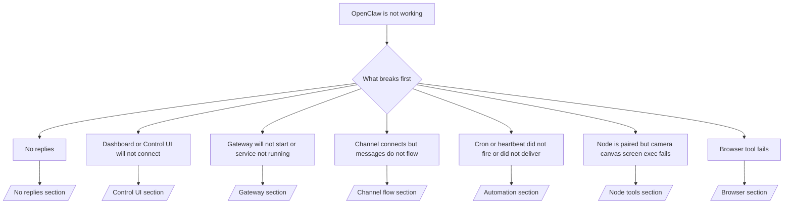

# Khắc phục sự cố

Nếu bạn chỉ có 2 phút, hãy sử dụng trang này làm cửa trước phân loại.
## 60 giây đầu tiên

Chạy chính xác các lệnh này theo thứ tự:

```bash
openclaw status
openclaw status --all
openclaw gateway probe
openclaw gateway status
openclaw doctor
openclaw channels status --probe
openclaw logs --follow
```

Good output in one line:

- `openclaw status` → shows configured channels and no obvious auth errors.
- `openclaw status --all` → full report is present and shareable.
- `openclaw gateway probe` → expected gateway target is reachable.
- `openclaw gateway status` → `Runtime: running` and `RPC probe: ok`.
- `openclaw doctor` → no blocking config/service errors.
- `openclaw channels status --probe` → channels report `connected` or `ready`.
- `openclaw logs --follow` → hoạt động ổn định, không có lỗi fatal lặp lại.
## Cây quyết định



<AccordionGroup>
  <Accordion title="No replies">
    ```bash
    openclaw status
    openclaw gateway status
    openclaw channels status --probe
    openclaw pairing list --channel <channel> [--account <id>]
    openclaw logs --follow
    ```

    Good output looks like:

    - `Runtime: running`
    - `RPC probe: ok`
    - Your channel shows connected/ready in `channels status --probe`
    - Sender appears approved (or DM policy is open/allowlist)

    Common log signatures:

    - `drop guild message (mention required` → mention gating blocked the message in Discord.
    - `pairing request` → sender is unapproved and waiting for DM pairing approval.
    - `blocked` / `allowlist` in channel logs → sender, room, or group is filtered.

    Deep pages:

    - [/gateway/troubleshooting#no-replies](/gateway/troubleshooting#no-replies)
    - [/channels/troubleshooting](/channels/troubleshooting)
    - [/channels/pairing](/channels/pairing)

  </Accordion>

  <Accordion title="Dashboard or Control UI will not connect">
    ```bash
    openclaw status
    openclaw gateway status
    openclaw logs --follow
    openclaw doctor
    openclaw channels status --probe
    ```
Đầu ra tốt trông như thế này:

- `Dashboard: http://...` được hiển thị trong `openclaw gateway status`
- `RPC probe: ok`
- Không có vòng lặp xác thực trong nhật ký

Chữ ký nhật ký phổ biến:

- `device identity required` → Ngữ cảnh HTTP/không an toàn không thể hoàn thành xác thực thiết bị.
- `unauthorized` / vòng lặp kết nối lại → token/mật khẩu sai hoặc không khớp chế độ xác thực.
- `gateway connect failed:` → UI đang nhắm mục tiêu đến URL/cổng sai hoặc gateway không thể truy cập.

Trang chi tiết:

- [/gateway/troubleshooting#dashboard-control-ui-connectivity](/gateway/troubleshooting#dashboard-control-ui-connectivity)
- [/web/control-ui](/web/control-ui)
- [/gateway/authentication](/gateway/authentication)

  </Accordion>

  <Accordion title="Gateway sẽ không khởi động hoặc dịch vụ được cài đặt nhưng không chạy">
    ```bash
    openclaw status
    openclaw gateway status
    openclaw logs --follow
    openclaw doctor
    openclaw channels status --probe
    ```

    Good output looks like:

    - `Service: ... (loaded)`
    - `Runtime: running`
    - `RPC probe: ok`

    Common log signatures:

    - `Gateway start blocked: set gateway.mode=local` → gateway mode is unset/remote.
    - `refusing to bind gateway ... without auth` → non-loopback bind without token/password.
    - `another gateway instance is already listening` or `EADDRINUSE` → port already taken.

    Deep pages:

    - [/gateway/troubleshooting#gateway-service-not-running](/gateway/troubleshooting#gateway-service-not-running)
    - [/gateway/background-process](/gateway/background-process)
    - [/gateway/configuration](/gateway/configuration)

  </Accordion>

  <Accordion title="Channel connects but messages do not flow">
    ```bash
    openclaw status
    openclaw gateway status
    openclaw logs --follow
    openclaw doctor
    openclaw channels status --probe
    ```

    Đầu ra tốt trông như thế này:
- Kết nối vận chuyển kênh được thiết lập.
- Kiểm tra ghép nối/danh sách cho phép vượt qua.
- Các đề cập được phát hiện khi cần thiết.

Chữ ký nhật ký phổ biến:

- `mention required` → gating đề cập nhóm đã chặn xử lý.
- `pairing` / `pending` → người gửi tin nhắn riêng chưa được phê duyệt.
- `not_in_channel`, `missing_scope`, `Forbidden`, `401/403` → vấn đề token quyền kênh.

Trang chi tiết:

- [/gateway/troubleshooting#channel-connected-messages-not-flowing](/gateway/troubleshooting#channel-connected-messages-not-flowing)
- [/channels/troubleshooting](/channels/troubleshooting)

  </Accordion>

  <Accordion title="Cron hoặc heartbeat không kích hoạt hoặc không gửi">
    ```bash
    openclaw status
    openclaw gateway status
    openclaw cron status
    openclaw cron list
    openclaw cron runs --id <jobId> --limit 20
    openclaw logs --follow
    ```

    Good output looks like:

    - `cron.status` shows enabled with a next wake.
    - `cron runs` shows recent `ok` entries.
    - Heartbeat is enabled and not outside active hours.

    Common log signatures:

    - `cron: scheduler disabled; jobs will not run automatically` → cron is disabled.
    - `heartbeat skipped` with `reason=quiet-hours` → outside configured active hours.
    - `requests-in-flight` → main lane busy; heartbeat wake was deferred.
    - `unknown accountId` → heartbeat delivery target account does not exist.

    Deep pages:

    - [/gateway/troubleshooting#cron-and-heartbeat-delivery](/gateway/troubleshooting#cron-and-heartbeat-delivery)
    - [/automation/troubleshooting](/automation/troubleshooting)
    - [/gateway/heartbeat](/gateway/heartbeat)

  </Accordion>

  <Accordion title="Node is paired but tool fails camera canvas screen exec">
    ```bash
    openclaw status
    openclaw gateway status
    openclaw nodes status
    openclaw nodes describe --node <idOrNameOrIp>
    openclaw logs --follow
    ```

    Đầu ra tốt trông như:
- Node được liệt kê là đã kết nối và ghép nối cho vai trò `node`.
- Khả năng tồn tại cho lệnh bạn đang gọi.
- Trạng thái quyền được cấp cho công cụ.

Chữ ký nhật ký phổ biến:

- `NODE_BACKGROUND_UNAVAILABLE` → đưa ứng dụng node vào tiền cảnh.
- `*_PERMISSION_REQUIRED` → quyền hệ điều hành bị từ chối/thiếu.
- `SYSTEM_RUN_DENIED: approval required` → phê duyệt exec đang chờ xử lý.
- `SYSTEM_RUN_DENIED: allowlist miss` → lệnh không có trong danh sách cho phép exec.

Trang chi tiết:

- [/gateway/troubleshooting#node-paired-tool-fails](/gateway/troubleshooting#node-paired-tool-fails)
- [/nodes/troubleshooting](/nodes/troubleshooting)
- [/tools/exec-approvals](/tools/exec-approvals)

  </Accordion>

  <Accordion title="Công cụ trình duyệt không hoạt động">
    ```bash
    openclaw status
    openclaw gateway status
    openclaw browser status
    openclaw logs --follow
    openclaw doctor
    ```

    Good output looks like:

    - Browser status shows `running: true` and a chosen browser/profile.
    - `openclaw` profile starts or `chrome` relay has an attached tab.

    Common log signatures:

    - `Failed to start Chrome CDP on port` → local browser launch failed.
    - `browser.executablePath not found` → configured binary path is wrong.
    - `Chrome extension relay is running, but no tab is connected` → extension not attached.
    - `Browser attachOnly is enabled ... not reachable` → hồ sơ attach-only không có mục tiêu CDP trực tiếp.

    Trang chi tiết:

    - [/gateway/troubleshooting#browser-tool-fails](/gateway/troubleshooting#browser-tool-fails)
    - [/tools/browser-linux-troubleshooting](/tools/browser-linux-troubleshooting)
    - [/tools/chrome-extension](/tools/chrome-extension)

  </Accordion>
</AccordionGroup>