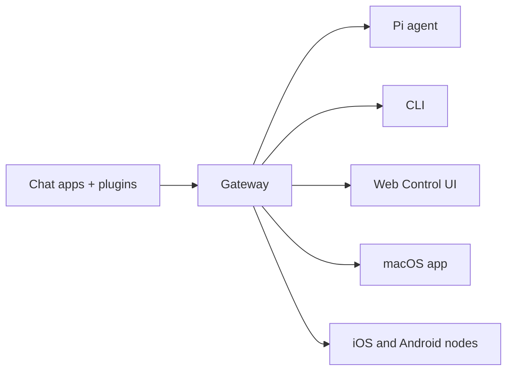

# OpenClaw 🦞

<p align="center">
    
    
</p>

> _"EXFOLIATE! EXFOLIATE!"_ — A space lobster, probably

<p align="center">
  <strong>Gateway cho AI agents trên bất kỳ hệ điều hành nào cho WhatsApp, Telegram, Discord, iMessage, và nhiều hơn nữa.</strong><br />
  Gửi một tin nhắn, nhận phản hồi từ agent trong túi của bạn. Các plugin bổ sung Mattermost và hơn thế nữa.
</p>

<Columns>
  <Card title="Bắt đầu" href="/start/getting-started" icon="rocket">
    Cài đặt OpenClaw và khởi động Gateway trong vài phút.
  </Card>
  <Card title="Chạy Trình hướng dẫn" href="/start/wizard" icon="sparkles">
    Thiết lập có hướng dẫn với `openclaw onboard` và các luồng ghép nối.
  </Card>
  <Card title="Mở Control UI" href="/web/control-ui" icon="layout-dashboard">
    Khởi chạy bảng điều khiển trình duyệt để trò chuyện, cấu hình và phiên.
  </Card>
</Columns>
## OpenClaw là gì?

OpenClaw là một **gateway tự lưu trữ** kết nối các ứng dụng chat yêu thích của bạn — WhatsApp, Telegram, Discord, iMessage, và nhiều ứng dụng khác — với các agent AI viết code như Pi. Bạn chạy một quy trình Gateway duy nhất trên máy của riêng mình (hoặc một máy chủ), và nó trở thành cầu nối giữa các ứng dụng nhắn tin của bạn và một trợ lý AI luôn sẵn sàng.

**Nó dành cho ai?** Các nhà phát triển và người dùng nâng cao muốn có một trợ lý AI cá nhân mà họ có thể nhắn tin từ bất kỳ đâu — mà không cần từ bỏ quyền kiểm soát dữ liệu của họ hoặc phụ thuộc vào một dịch vụ được lưu trữ.

**Điều gì làm cho nó khác biệt?**

- **Tự lưu trữ**: chạy trên phần cứng của bạn, theo quy tắc của bạn
- **Đa kênh**: một Gateway phục vụ WhatsApp, Telegram, Discord, và nhiều ứng dụng khác cùng lúc
- **Hỗ trợ agent**: được xây dựng cho các agent viết code với sử dụng công cụ, phiên, bộ nhớ, và định tuyến đa agent
- **Mã nguồn mở**: được cấp phép MIT, do cộng đồng điều hành

**Bạn cần gì?** Node 22+, một khóa API (Anthropic được khuyến nghị), và 5 phút.
## Cách hoạt động



Gateway là nguồn thông tin duy nhất cho các phiên, định tuyến và kết nối kênh.
## Các khả năng chính

<Columns>
  <Card title="Gateway đa kênh" icon="network">
    WhatsApp, Telegram, Discord, và iMessage với một quy trình Gateway duy nhất.
  </Card>
  <Card title="Kênh plugin" icon="plug">
    Thêm Mattermost và nhiều hơn nữa với các gói mở rộng.
  </Card>
  <Card title="Định tuyến đa agent" icon="route">
    Các phiên riêng biệt cho mỗi agent, workspace hoặc người gửi.
  </Card>
  <Card title="Hỗ trợ phương tiện" icon="image">
    Gửi và nhận hình ảnh, âm thanh và tài liệu.
  </Card>
  <Card title="Giao diện điều khiển Web" icon="monitor">
    Bảng điều khiển trình duyệt để trò chuyện, cấu hình, phiên và node.
  </Card>
  <Card title="Node di động" icon="smartphone">
    Ghép nối các node iOS và Android với hỗ trợ Canvas.
  </Card>
</Columns>
## Bắt đầu nhanh

<Steps>
  <Step title="Cài đặt OpenClaw">
    ```bash
    npm install -g openclaw@latest
    ```
  </Step>
  <Step title="Onboard and install the service">
    ```bash
    openclaw onboard --install-daemon
    ```
  </Step>
  <Step title="Pair WhatsApp and start the Gateway">
    ```bash
    openclaw channels login
    openclaw gateway --port 18789
    ```
  </Step>
</Steps>

Cần thiết lập cài đặt và phát triển đầy đủ? Xem [Bắt đầu nhanh](/start/quickstart).
## Bảng điều khiển

Mở giao diện điều khiển trình duyệt sau khi Gateway khởi động.

- Mặc định cục bộ: [http://127.0.0.1:18789/](http://127.0.0.1:18789/)
- Truy cập từ xa: [Các bề mặt web](/web) và [Tailscale](/gateway/tailscale)

<p align="center">
  
</p>
## Cấu hình (tùy chọn)

Cấu hình nằm tại `~/.openclaw/openclaw.json`.

- Nếu bạn **không làm gì**, OpenClaw sử dụng nhị phân Pi đi kèm ở chế độ RPC với các phiên riêng theo người gửi.
- Nếu bạn muốn khóa chặt, hãy bắt đầu với `channels.whatsapp.allowFrom` và (đối với các nhóm) đề cập đến các quy tắc.

Ví dụ:

```json5
{
  channels: {
    whatsapp: {
      allowFrom: ["+15555550123"],
      groups: { "*": { requireMention: true } },
    },
  },
  messages: { groupChat: { mentionPatterns: ["@openclaw"] } },
}
```
## Bắt đầu

<Columns>
  <Card title="Trung tâm tài liệu" href="/start/hubs" icon="book-open">
    Tất cả tài liệu và hướng dẫn, được tổ chức theo trường hợp sử dụng.
  </Card>
  <Card title="Cấu hình" href="/gateway/configuration" icon="settings">
    Cài đặt Gateway cốt lõi, token và cấu hình nhà cung cấp.
  </Card>
  <Card title="Truy cập từ xa" href="/gateway/remote" icon="globe">
    Các mẫu truy cập SSH và tailnet.
  </Card>
  <Card title="Kênh" href="/channels/telegram" icon="message-square">
    Thiết lập dành riêng cho kênh WhatsApp, Telegram, Discord và nhiều hơn nữa.
  </Card>
  <Card title="Nút" href="/nodes" icon="smartphone">
    Nút iOS và Android với ghép nối và Canvas.
  </Card>
  <Card title="Trợ giúp" href="/help" icon="life-buoy">
    Các bản sửa lỗi phổ biến và điểm vào khắc phục sự cố.
  </Card>
</Columns>
## Tìm hiểu thêm

<Columns>
  <Card title="Danh sách tính năng đầy đủ" href="/concepts/features" icon="list">
    Khả năng kênh, định tuyến và phương tiện hoàn chỉnh.
  </Card>
  <Card title="Định tuyến đa agent" href="/concepts/multi-agent" icon="route">
    Cách ly không gian làm việc và phiên cho từng agent.
  </Card>
  <Card title="Bảo mật" href="/gateway/security" icon="shield">
    Token, danh sách cho phép và kiểm soát an toàn.
  </Card>
  <Card title="Khắc phục sự cố" href="/gateway/troubleshooting" icon="wrench">
    Chẩn đoán Gateway và các lỗi phổ biến.
  </Card>
  <Card title="Về dự án và ghi nhận" href="/reference/credits" icon="info">
    Nguồn gốc dự án, những người đóng góp và giấy phép.
  </Card>
</Columns>