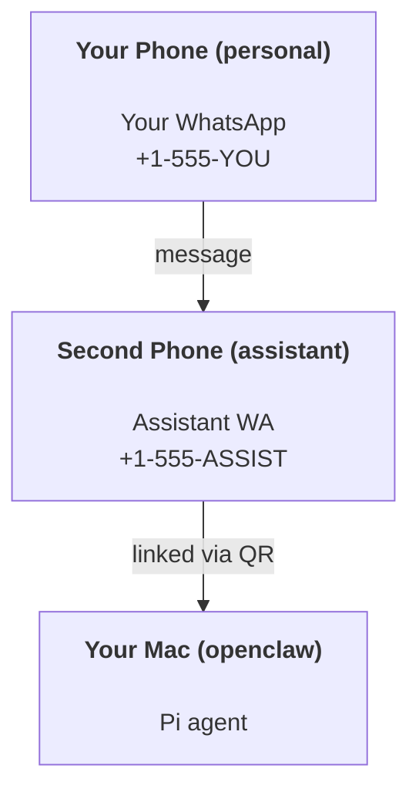

# Xây dựng trợ lý cá nhân với OpenClaw

OpenClaw là một Gateway WhatsApp + Telegram + Discord + iMessage dành cho các agent **Pi**. Các plugin bổ sung Mattermost. Hướng dẫn này là thiết lập "trợ lý cá nhân": một số WhatsApp chuyên dụng hoạt động như agent luôn bật của bạn.

## ⚠️ An toàn là trên hết

Bạn đang đặt một agent vào vị trí có thể:

- chạy các lệnh trên máy của bạn (tùy thuộc vào thiết lập công cụ Pi của bạn)
- đọc/ghi tệp trong không gian làm việc của bạn
- gửi tin nhắn trở lại qua WhatsApp/Telegram/Discord/Mattermost (plugin)

Hãy bắt đầu một cách thận trọng:

- Luôn đặt `channels.whatsapp.allowFrom` (không bao giờ chạy mở-ra-thế-giới trên máy Mac cá nhân của bạn).
- Sử dụng một số WhatsApp chuyên dụng cho trợ lý.
- Nhịp tim hiện mặc định là 30 phút một lần. Tắt tính năng này cho đến khi bạn tin tưởng vào thiết lập bằng cách đặt `agents.defaults.heartbeat.every: "0m"`.

## Điều kiện tiên quyết

- OpenClaw đã được cài đặt và thiết lập ban đầu — xem [Bắt đầu](/start/getting-started) nếu bạn chưa thực hiện điều này
- Một số điện thoại thứ hai (SIM/eSIM/trả trước) cho trợ lý
## Thiết lập hai điện thoại (được khuyến nghị)

Bạn muốn điều này:



Nếu bạn liên kết WhatsApp cá nhân của mình với OpenClaw, mọi tin nhắn gửi đến bạn sẽ trở thành “đầu vào của agent”. Điều này hiếm khi là điều bạn muốn.

## Bắt đầu nhanh trong 5 phút

1. Ghép nối WhatsApp Web (hiển thị mã QR; quét bằng điện thoại trợ lý):

```bash
openclaw channels login
```

2. Start the Gateway (leave it running):

```bash
openclaw gateway --port 18789
```

3. Put a minimal config in `Thao tác này sẽ tạo một tệp ~/.openclaw/openclaw.json`:

`với ``json5
{
  channels: { whatsapp: { allowFrom: ["+15555550123"] } },
}
```

Now message the assistant number from your allowlisted phone.

When onboarding finishes, we auto-open the dashboard and print a clean (non-tokenized) link. If it prompts for auth, paste the token from `gateway.auth.token` into Control UI settings. To reopen later: `của bạn mà bạn có thể sử dụng để đăng nhập vào `openclaw dashboard`.

## Cung cấp không gian làm việc cho agent (AGENTS)

OpenClaw đọc hướng dẫn vận hành và “bộ nhớ” từ thư mục không gian làm việc của nó.

Theo mặc định, OpenClaw sử dụng `~/.openclaw/workspace` làm không gian làm việc của agent, và sẽ tự động tạo nó (cùng với các tệp khởi động `AGENTS.md`, `SOUL.md`, `TOOLS.md`, `IDENTITY.md`, `USER.md`, `HEARTBEAT.md`) khi thiết lập/chạy agent lần đầu. `BOOTSTRAP.md` chỉ được tạo khi không gian làm việc hoàn toàn mới (nó sẽ không xuất hiện lại sau khi bạn xóa). `MEMORY.md` là tùy chọn (không tự động tạo); khi có mặt, nó được tải cho các phiên thông thường. Các phiên subagent chỉ chèn `AGENTS.md` và `TOOLS.md`.

Mẹo: hãy coi thư mục này như “bộ nhớ” của OpenClaw và biến nó thành một git repo (lý tưởng là riêng tư) để các tệp `AGENTS.md` + bộ nhớ của bạn được sao lưu. Nếu git được cài đặt, các không gian làm việc hoàn toàn mới sẽ được tự động khởi tạo.

```bash
openclaw setup
```

Full workspace layout + backup guide: [Agent workspace](/concepts/agent-workspace)
Memory workflow: [Memory](/concepts/memory)

Optional: choose a different workspace with `agents.defaults.workspace` (supports `~`).

```json5
{
  agent: {
    workspace: "~/.openclaw/workspace",
  },
}
```

If you already ship your own workspace files from a repo, you can disable bootstrap file creation entirely:

```json5
{
  agent: {
    skipBootstrap: true,
  },
}
```
## Cấu hình biến nó thành “một trợ lý”

OpenClaw mặc định là một thiết lập trợ lý tốt, nhưng bạn thường sẽ muốn điều chỉnh:

- tính cách/hướng dẫn trong `SOUL.md`
- mặc định suy nghĩ (nếu muốn)
- nhịp tim (khi bạn đã tin tưởng nó)

Ví dụ:

```json5
{
  logging: { level: "info" },
  agent: {
    model: "anthropic/claude-opus-4-6",
    workspace: "~/.openclaw/workspace",
    thinkingDefault: "high",
    timeoutSeconds: 1800,
    // Start with 0; enable later.
    heartbeat: { every: "0m" },
  },
  channels: {
    whatsapp: {
      allowFrom: ["+15555550123"],
      groups: {
        "*": { requireMention: true },
      },
    },
  },
  routing: {
    groupChat: {
      mentionPatterns: ["@openclaw", "openclaw"],
    },
  },
  session: {
    scope: "per-sender",
    resetTriggers: ["/new", "/reset"],
    reset: {
      mode: "daily",
      atHour: 4,
      idleMinutes: 10080,
    },
  },
}
```
## Phiên và bộ nhớ

- Tệp phiên: `~/.openclaw/agents/<agentId>/sessions/{{SessionId}}.jsonl`
- Siêu dữ liệu phiên (lượng token sử dụng, tuyến đường cuối cùng, v.v.): `~/.openclaw/agents/<agentId>/sessions/sessions.json` (cũ: `~/.openclaw/sessions/sessions.json`)
- `/new` hoặc `/reset` bắt đầu một phiên mới cho cuộc trò chuyện đó (có thể cấu hình qua `resetTriggers`). Nếu được gửi riêng, agent sẽ trả lời bằng một lời chào ngắn để xác nhận việc đặt lại.
- `/compact [instructions]` nén ngữ cảnh phiên và báo cáo ngân sách ngữ cảnh còn lại.

## Nhịp tim (chế độ chủ động)

Theo mặc định, OpenClaw chạy một nhịp tim mỗi 30 phút với lời nhắc:
`Read HEARTBEAT.md if it exists (workspace context). Follow it strictly. Do not infer or repeat old tasks from prior chats. If nothing needs attention, reply HEARTBEAT_OK.`
Đặt `agents.defaults.heartbeat.every: "0m"` để tắt.

- Nếu `HEARTBEAT.md` tồn tại nhưng thực sự trống (chỉ có các dòng trống và tiêu đề markdown như `# Heading`), OpenClaw sẽ bỏ qua lần chạy nhịp tim để tiết kiệm các cuộc gọi API.
- Nếu tệp bị thiếu, nhịp tim vẫn chạy và mô hình sẽ quyết định phải làm gì.
- Nếu agent trả lời bằng `HEARTBEAT_OK` (tùy chọn với phần đệm ngắn; xem `agents.defaults.heartbeat.ackMaxChars`), OpenClaw sẽ chặn việc gửi đi cho nhịp tim đó.
- Theo mặc định, việc gửi nhịp tim đến các mục tiêu `user:<id>` kiểu tin nhắn riêng được cho phép. Đặt `agents.defaults.heartbeat.directPolicy: "block"` để chặn việc gửi đến mục tiêu trực tiếp trong khi vẫn giữ các lần chạy nhịp tim hoạt động.
- Nhịp tim chạy đầy đủ lượt của agent — khoảng thời gian ngắn hơn sẽ tiêu tốn nhiều token hơn.

```json5
{
  agent: {
    heartbeat: { every: "30m" },
  },
}
```
## Phương tiện truyền thông vào và ra

Các tệp đính kèm đến (hình ảnh/âm thanh/tài liệu) có thể được hiển thị cho lệnh của bạn thông qua các mẫu:

- `{{MediaPath}}` (đường dẫn tệp tạm thời cục bộ)
- `{{MediaUrl}}` (URL giả)
- `{{Transcript}}` (nếu tính năng chuyển đổi giọng nói thành văn bản được bật)

Các tệp đính kèm gửi đi từ agent: bao gồm `MEDIA:<path-or-url>` trên một dòng riêng (không có khoảng trắng). Ví dụ:

```
Here’s the screenshot.
MEDIA:https://example.com/screenshot.png
```

OpenClaw trích xuất các tệp này và gửi chúng dưới dạng phương tiện truyền thông cùng với văn bản.
## Danh sách kiểm tra vận hành

``__OC_I19N_0000__`__OC_I19N_0001__/tmp/openclaw/__OC_I19N_0002__openclaw-YYYY-MM-DD.log`).

## Các bước tiếp theo

- WebChat: [WebChat](/web/webchat)
- Vận hành Gateway: [Sổ tay vận hành Gateway](/gateway)
- Cron + đánh thức: [Cron jobs](/automation/cron-jobs)
- Ứng dụng đồng hành trên thanh menu macOS: [Ứng dụng OpenClaw macOS](/platforms/macos)
- Ứng dụng node iOS: [Ứng dụng iOS](/platforms/ios)
- Ứng dụng node Android: [Ứng dụng Android](/platforms/android)
- Trạng thái Windows: [Windows (/platforms/windows)
- Trạng thái Linux: [Ứng dụng Linux](/platforms/linux)
- Bảo mật: [Bảo mật](/gateway/security)
